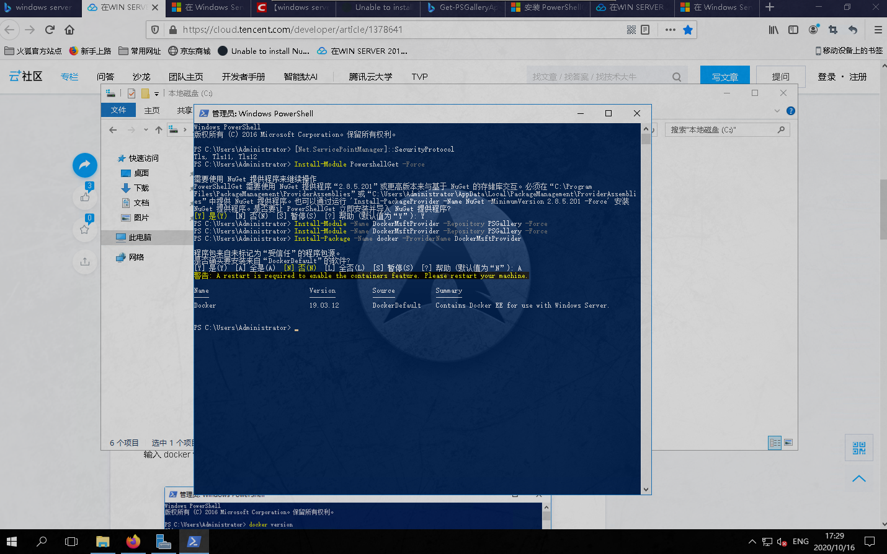
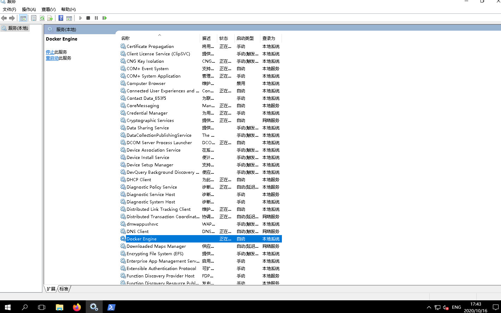
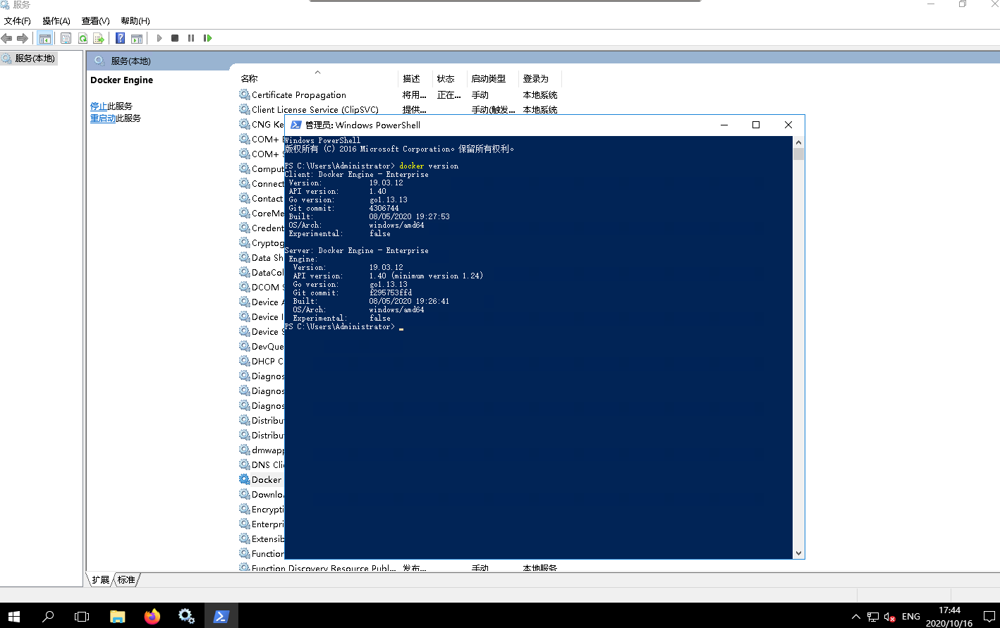

<!--
@author: harold.duan
@date: 20-10-01
@memo: Notes logging
-->

## RDS Upgrade

  + **Portainer**

  ```
  $ docker pull rds.avatech.com.cn:8082/portainer/portainer

  $ docker run --privileged=true --restart=always -d \
    --network=portainer-net --network-alias=portainer \
    --ip=172.18.0.2 \
    -p 9000:9000 \
    -v /var/run/docker.sock:/var/run/docker.sock \
    -v /home/git/docker-data/portainer:/data \
    --name portainer \
    rds.avatech.com.cn:8082/portainer/portainer
  ```

  + **Gitea**

  ```
  $ docker pull rds.avatech.com.cn:8082/gitea/gitea:latest

  $ docker run --privileged=true --restart=always -d \
    --network=gitea-net --network-alias=gitea \
    --ip=172.20.0.2 \
    -p 1022:22 -p 7070:3000 \
    -v /home/git/docker-data/gitea:/data \
    --name=gitea \
    rds.avatech.com.cn:8082/gitea/gitea:latest
  ```

  + **Nexus3**

  ```
  $ docker pull rds.avatech.com.cn:8082/sonatype/nexus3:latest

  $ docker network create nexus-net --subnet=172.25.0.0/16
  
  $ docker run --privileged=true --restart=always -d \
    --network=nexus-net --network-alias=nexus \
    --ip=172.25.0.2 \
    -p 8081:8081 -p 8082:8082 -p 8083:8083 \
    -v /home/git/docker-data/nexus/nexus-data:/nexus-data \
    --name=nexus \
    rds.avatech.com.cn:8082/sonatype/nexus3:latest
  ```

  + **Nextcloud**

  ```
  $ docker pull rds.avatech.com.cn:8082/nextcloud:latest

  $ docker run --privileged=true --restart=always -d \
    -p 10080:80 \
    -v /home/git/docker-data/nextcloud:/var/www/html \
    --name=nextcloud \
    rds.avatech.com.cn:8082/nextcloud
  ```

  + **Drone**

  ClientID:ba71bc70-c651-47d4-9672-8048f5d6d1d3
  ClientSecret:MqyecgFXwkYnCwr2tZMB3HXiU9cHNfwzlCwq5QUoR3w=

  ```
  # $ docker pull rds.avatech.com.cn:8082/drone/drone
  $ docker pull drone/drone
  $ docker run \
    --privileged=true --restart=always -d \
    --network=drone-net --network-alias=drone \
    --ip=172.22.0.2 \
    --volume=/var/run/docker.sock:/var/run/docker.sock \
    --volume=/home/git/docker-data/drone:/data \
    --env=DRONE_GITEA=true \
    --env=DRONE_GITEA_SERVER=http://rds.avatech.com.cn:7070 \
    --env=DRONE_GITEA_CLIENT_ID=ba71bc70-c651-47d4-9672-8048f5d6d1d3 \
    --env=DRONE_GITEA_CLIENT_SECRET=MqyecgFXwkYnCwr2tZMB3HXiU9cHNfwzlCwq5QUoR3w= \
    --env=DRONE_SERVER_HOST=rds.avatech.com.cn:5050 \
    --env=DRONE_RPC_SECRET=16096fbe839fad18b6e060a1a05c79e7 \
    --env=DRONE_USER_CREATE=username:codebot,admin:false \
    --env=DRONE_SERVER_PROTO=http \
    --env=DRONE_TLS_AUTOCERT=false \
    --env=DRONE_AGENTS_ENABLED=true \
    --publish=5050:80 \
    --publish=443:443 \
    --restart=always \
    --name=drone \
    drone/drone:latest

  $ docker run \
    --privileged=true --restart=always -d \
    --network=drone-net --network-alias=drone \
    --ip=172.22.0.2 \
    --volume=/var/run/docker.sock:/var/run/docker.sock \
    --volume=/home/git/docker-data/drone:/data \
    --env=DRONE_GITEA=true \
    --env=DRONE_GITEA_SERVER=http://rds.avatech.com.cn:7070 \
    --env=DRONE_GITEA_CLIENT_ID=ba71bc70-c651-47d4-9672-8048f5d6d1d3 \
    --env=DRONE_GITEA_CLIENT_SECRET=MqyecgFXwkYnCwr2tZMB3HXiU9cHNfwzlCwq5QUoR3w= \
    --env=DRONE_SERVER_HOST=rds.avatech.com.cn:5050 \
    --env=DRONE_RPC_SECRET=16096fbe839fad18b6e060a1a05c79e7 \
    --env=DRONE_USER_CREATE=username:codebot,admin:true \
    --env=DRONE_SERVER_PROTO=http \
    --env=DRONE_TLS_AUTOCERT=false \
    --env=DRONE_AGENTS_ENABLED=true \
    --publish=5050:80 \
    --publish=443:443 \
    --restart=always \
    --name=drone \
    drone/drone:latest
  ```

  + **Drone Agent**

  ```
  # $ docker pull rds.avatech.com.cn:8082/drone/agent
  $ docker pull drone/agent
  $ docker run --privileged=true --restart=always -d \
    -v /var/run/docker.sock:/var/run/docker.sock \
    --network=drone-net --network-alias=drone-agent \
    --ip=172.22.0.3 \
    -e DRONE_RPC_PROTO=http \
    -e DRONE_RPC_HOST=rds.avatech.com.cn:5050 \
    -e DRONE_RPC_SECRET=16096fbe839fad18b6e060a1a05c79e7 \
    -e DRONE_RUNNER_CAPACITY=2 \
    -e DRONE_RUNNER_NAME=rds.avatech.com.cn \
    -e DRONE_LOGS_DEBUG=true \
    --env=DRONE_LOGS_TRACE=true \
    -p 5000:3000 \
    --name drone-agent \
    drone/agent:latest
  ```

  + **Nextcloud**

  ```
  $ docker pull nextcloud
  $ docker run --privileged=true -d \
    -v /home/admin/dockers/nextcloud:/var/www/html \
    -v /home/admin/dockers/nextcloud/apps:/var/www/html/custom_apps \
    -v /home/admin/dockers/nextcloud/config:/var/www/html/config \
    -v /home/admin/dockers/nextcloud/data:/var/www/html/data \
    -p 8080:80 \
    --name nextcloud \
    nextcloud
  $ sudo vim config/config.php

  <?php
  $CONFIG = array (
    'htaccess.RewriteBase' => '/',
    'memcache.local' => '\\OC\\Memcache\\APCu',
    'apps_paths' =>
    array (
      0 =>
      array (
        'path' => '/var/www/html/apps',
        'url' => '/apps',
        'writable' => false,
      ),
      1 =>
      array (
        'path' => '/var/www/html/custom_apps',
        'url' => '/custom_apps',
        'writable' => true,
      ),
    ),
    'instanceid' => 'och9bka300hc',
    'passwordsalt' => 'ACqKhORvSIyfFcyrcpn8EiMkxoO5sd',
    'secret' => '5jkBmEkoUVc5nxZJFanbbX/HUThVywlsGcgj7lHQh36xFFIE',
    'trusted_domains' =>
    array (
      0 => '192.168.3.14:8080',
    ),
    'datadirectory' => '/var/www/html/data',
    'dbtype' => 'sqlite3',
    'version' => '20.0.0.9',
    'overwrite.cli.url' => 'http://192.168.3.14:8080',
    'installed' => true,
    'allow_local_remote_servers' => true, #新增此行，配置允许局域网远程服务器
    'ldapIgnoreNamingRules' => false,
    'ldapProviderFactory' => 'OCA\\User_LDAP\\LDAPProviderFactory',
    'mail_smtpmode' => 'smtp',
    'mail_smtpsecure' => 'ssl',
    'mail_sendmailmode' => 'smtp',
    'mail_smtphost' => 'smtp.qiye.aliyun.com',
    'mail_from_address' => 'avardd',
    'mail_domain' => 'avatech.com.cn',
    'mail_smtpauth' => 1,
    'mail_smtpport' => '465',
    'mail_smtpname' => 'avardd@avatech.com.cn',
    'mail_smtppassword' => '1qaz@WSX',
  );
  ```

  + **OnlyOffice DocumentServer**

  ```
  $ docker pull onlyoffice/documentserver
  $ docker run --privileged=true \
    -i -t -d -p 9080:80 --restart=always \
    --name onlyoffice-document-server \
    -v /home/admin/dockers/onlyoffice/DocumentServer/logs:/var/log/onlyoffice \
    -v /home/admin/dockers/onlyoffice/DocumentServer/data:/var/www/onlyoffice/Data \
    -v /home/admin/dockers/onlyoffice/DocumentServer/lib:/var/lib/onlyoffice \
    -v /home/admin/dockers/onlyoffice/DocumentServer/db:/var/lib/postgresql \
    onlyoffice/documentserver
  ```

  + **Collabora Online** *废弃不用*

  ```
  $ docker pull docker.io/collabora/code:latest
  $ docker pull collabora/code
  $ docker run -t -d --privileged=true \
    -p 9980:9980 -e "domain=192\\.168\\.3\\.14" \
    -e "username=admin" -e "password=1qaz@WSX" --restart always \
    -e "extra_params=–o:ssl.enable=false" \
    --cap-add MKNOD \
    --name collabora-online \
    collabora/code
  $ sudo firewall-cmd --zone=public --add-port=9980/tcp --permanent
  ```

  ***RDS***

  ```
  $ docker pull rds.avatech.com.cn:8082/nextcloud
  $ docker run --privileged=true -d \
    -v /home/git/docker-data/nextcloud:/var/www/html \
    -v /home/git/docker-data/nextcloud/apps:/var/www/html/custom_apps \
    -v /home/git/docker-data/nextcloud/config:/var/www/html/config \
    -v /home/git/docker-data/nextcloud/data:/var/www/html/data \
    -p 10080:80 \
    --name nextcloud \
    rds.avatech.com.cn:8082/nextcloud
  ```

  ```
  $ docker pull onlyoffice/documentserver
  $ docker run --privileged=true \
    -i -t -d -p 8000:80 --restart=always \
    --name onlyoffice-document-server \
    -v /home/git/docker-data/onlyoffice/DocumentServer/logs:/var/log/onlyoffice \
    -v /home/git/docker-data/onlyoffice/DocumentServer/data:/var/www/onlyoffice/Data \
    -v /home/git/docker-data/onlyoffice/DocumentServer/lib:/var/lib/onlyoffice \
    -v /home/git/docker-data/onlyoffice/DocumentServer/db:/var/lib/postgresql \
    onlyoffice/documentserver
  ```

  + **OpenProject**

  ```
  # $ docker pull openproject/community
  $ docker pull openproject/community:11
  $ docker run --privileged=true -d \
    --name openproject \
    -p 1080:80 -e SECRET_KEY_BASE=secret \
    -v /home/admin/dockers/openproject/pgdata:/var/openproject/pgdata \
    -v /home/admin/dockers/openproject/assets:/var/openproject/assets \
    openproject/community:11
  $ sudo firewall-cmd --zone=public --add-port=1080/tcp --permanent
  ```

  + ***Odoo***

  ```
  $ docker pull postgres:10
  $ docker run --privileged=true -d \
    --name odoo-postgres \
    -e POSTGRES_USER=odoo -e POSTGRES_PASSWORD=odoo \
    -e POSTGRES_DB=postgres -e PGDATA=/var/lib/postgresql/data/pgdata \
    -v /home/admin/dockers/odoo-postgres/conf:/etc/postgresql \
    -v /home/admin/dockers/odoo-postgres/data:/var/lib/postgresql/data \
    -p 5432:5432 \
    postgres:10
  $ sudo firewall-cmd --zone=public --add-port=5432/tcp --permanent
  $ docker pull odoo
  $ docker run --privileged=true -d \
    --name odoo-web \
    -v /home/admin/dockers/odoo-web/data:/var/lib/odoo \
    -v /home/admin/dockers/odoo-web/config:/etc/odoo \
    -v /home/admin/dockers/odoo-web/addons:/mnt/extra-addons \
    -p 8069:8069 \
    --link odoo-postgres:db \
    odoo
  docker run --privileged=true -d \
    --name odoo-web \
    -v /home/admin/dockers/odoo-web/addons:/mnt/extra-addons \
    -p 8069:8069 \
    --link odoo-postgres:db \
    odoo
  $ sudo firewall-cmd --zone=public --add-port=8069/tcp --permanent
  ```

  + ***Docker on Windows***

  *PowerShell*

  ```
  $ Install-Module -Name DockerMsftProvider -Repository PSGallery -Force
  $ Install-Package -Name docker -ProviderName DockerMsftProvider
  # $ install-package -name docker -providername DockerMsftProvider -Verbose
  $ Restart-Computer -Force
  ```







  *Error*

  > error during connect: Get http://%2F%2F.%2Fpipe%2Fdocker_engine/v1.40/version: open //./pipe/docker_engine: The system cannot find the file specified. In the default daemon configuration on Windows, the docker client must be run elevated to connect. This error may also indicate that the docker daemon is not running.

  ```
  $ Get-Host | Select-Object Version
  > Version
    -------
    5.1.14393.3471

  $ [Net.ServicePointManager]::SecurityProtocol
  > Ssl3, Tls

  $ Set-ItemProperty -Path 'HKLM:\SOFTWARE\Wow6432Node\Microsoft\.NetFramework\v4.0.30319' -Name 'SchUseStrongCrypto' -Value '1' -Type DWord

  $ Set-ItemProperty -Path 'HKLM:\SOFTWARE\Microsoft\.NetFramework\v4.0.30319' -Name 'SchUseStrongCrypto' -Value '1' -Type DWord

  # Restart Powershell and check for supported security protocols.
  $ [Net.ServicePointManager]::SecurityProtocol
  > Tls, Tls11, Tls12

  $ Install-Module PowershellGet -Force
  ```

  *Configuration*

  ***Path:*** *C:\ProgramData\Docker\config\daemon.json*

  ```
  {
      "authorization-plugins": [],
      "dns": [],
      "dns-opts": [],
      "dns-search": [],
      "exec-opts": [],
      "storage-driver": "",
      "storage-opts": [],
      "labels": [],
      "log-driver": "",
      "mtu": 0,
      "pidfile": "",
      "data-root": "",
      "cluster-store": "",
      "cluster-advertise": "",
      "debug": true,
      "hosts": [],
      "log-level": "",
      "tlsverify": true,
      "tlscacert": "",
      "tlscert": "",
      "tlskey": "",
      "group": "",
      "default-ulimits": {},
      "bridge": "",
      "fixed-cidr": "",
      "raw-logs": false,
      "registry-mirrors": [],
      "insecure-registries": [],
      "disable-legacy-registry": false
  }
  ```


### Scoop

  + **Install**

  > 用户名不含中文字符
  > Windows 7 SP1+ / Windows Server 2008+
  > PowerShell 3+
  > .NET Framework 4.5+
  > 若Powershell或.NET Franmework版本过旧，更新后重启即可。
  > 若不清楚版本号，可Win+R运行powershell，输入以下命令获取版本号。

  ``` PowerShell
  $PSVersionTable.PSVersion.Major   #查看Powershell版本
  $PSVersionTable.CLRVersion.Major  #查看.NET Framework版本
  ```

  ```
  $env:SCOOP='C:\Scoop'

  # [Environment]::SetEnvironmentVariable('SCOOP', $env:SCOOP, 'User') #用户环境变量

  [Environment]::SetEnvironmentVariable('SCOOP', $env:SCOOP, 'Machine') #系统环境变量

  Set-ExecutionPolicy RemoteSigned -scope CurrentUser

  Invoke-Expression (New-Object System.Net.WebClient).DownloadString('https://get.scoop.sh')

  # or shorter
  iwr -useb get.scoop.sh | iex

  # 更改系统环境变量 Path 追加 C:\Scoop\shims
  ```

### NodeJS in Windows

  ```
  npm config ls
  npm config set prefix "C:\Program Files\nodejs\node_global"
  npm config set cache "C:\Program Files\nodejs\node_cache"
  npm config set registry https://registry.npm.taobao.org

  # 用户变量 path 中把 C:\Users\Administrator\AppData\Roaming\npm;---改为----C:\Program Files\nodejs\node_global

  # 在系统变量中 新增变量NODE_PATH----- C:\Program Files\nodejs\node_global\node_modules

  # 系统变量中 path:C:\Program Files\nodejs\;C:\Program Files\nodejs\node_global\node_modules;
  ```